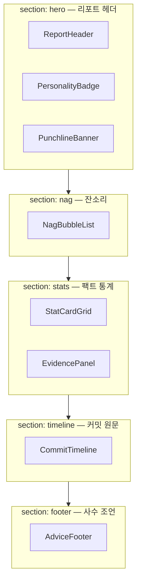

# ai nag 대시보드 UI 컴포넌트 명세서

> React + Vite 이식 전 설계 문서  
> 데이터 소스: `mock-report-output.json` (`NagDashboardReport`)  
> 레이아웃 정의: `src/ui/dashboardLayout.ts`  
> 타입 정의: `src/types/uiComponents.ts`

---

## 1. 화면 전체 구조



### 데이터 진입점

프론트엔드는 API 또는 mock JSON에서 **`report.view`** 객체 하나만 넘기면 된다.

```typescript
// React/Vite 예시
import report from '../mock-report-output.json';
import type { NagDashboardReport } from '@/types/uiComponents';

const data = (report as NagDashboardReport).view;

// DASHBOARD_LAYOUT 순회
// report.view[slot.dataKey] → 해당 컴포넌트 props
```

| `DASHBOARD_LAYOUT` 섹션 | `dataKey` | 컴포넌트 |
|---|---|---|
| `hero` | `header` | ReportHeader |
| `hero` | `personality` | PersonalityBadge |
| `hero` | `punchline` | PunchlineBanner |
| `nag` | `nagBubbles` | NagBubbleList |
| `stats` | `statCards` | StatCardGrid |
| `stats` | `evidence` | EvidencePanel |
| `timeline` | `commitTimeline` | CommitTimeline |
| `footer` | `advice` | AdviceFooter |

---

## 2. 컴포넌트 8종 — 역할 및 데이터 매핑

### 2-1. ReportHeader

| 항목 | 내용 |
|---|---|
| **역할** | 분석 대상 레포, 분석 시각, 커밋 수, 분석 기간을 상단에 표시 |
| **React 파일** | `src/components/ReportHeader.tsx` |
| **Props 타입** | `ReportHeaderProps` |

**데이터 매핑**

| Props 필드 | JSON 경로 | 예시 값 |
|---|---|---|
| `repo` | `view.header.repo` | `"octocat/Hello-World"` |
| `analyzedAt` | `view.header.analyzedAt` | `"2026-07-04T17:06:58.172Z"` |
| `commitCount` | `view.header.commitCount` | `3` |
| `dateRangeLabel` | `view.header.dateRangeLabel` | `"2011-01-27 ~ 2012-03-07"` |

**원본 데이터 교차 참조 (선택)**

| Props | 대체 원본 경로 |
|---|---|
| `repo` | `meta.repo` |
| `analyzedAt` | `meta.analyzed_at` |
| `commitCount` | `meta.commit_count` |
| `dateRangeLabel` | `stats.date_range.first` + `stats.date_range.last` (가공 필요) |

```typescript
interface ReportHeaderProps {
  repo: string;
  analyzedAt: string;
  commitCount: number;
  dateRangeLabel: string;
}
```

---

### 2-2. PersonalityBadge

| 항목 | 내용 |
|---|---|
| **역할** | AI가 판별한 주·부 성향 뱃지, 확신도(%), 성향별 테마 색상 표시 |
| **React 파일** | `src/components/PersonalityBadge.tsx` |
| **Props 타입** | `PersonalityBadgeProps` |

**데이터 매핑**

| Props 필드 | JSON 경로 | 예시 값 |
|---|---|---|
| `typeId` | `view.personality.typeId` | `3` |
| `typeLabel` | `view.personality.typeLabel` | `"주객전도형 감정표현 일기장러"` |
| `confidence` | `view.personality.confidence` | `95` |
| `secondaryTypeLabel` | `view.personality.secondaryTypeLabel` | `"벼락치기형 깃허브 학대파"` |
| `theme.accent` | `view.personality.theme.accent` | `"#f39c12"` |
| `theme.badge` | `view.personality.theme.badge` | `"📓"` |

**원본 데이터 교차 참조**

| Props | 대체 원본 경로 |
|---|---|
| `typeId` | `analysis.type_id` |
| `typeLabel` | `analysis.type_label` |
| `confidence` | `analysis.confidence` |
| `secondaryTypeLabel` | `analysis.secondary_type_id` → 라벨 변환 필요 |

```typescript
interface PersonalityBadgeProps {
  typeId: 1 | 2 | 3 | 4 | 5;
  typeLabel: string;
  confidence: number;
  secondaryTypeLabel: string | null;
  theme: { accent: string; badge: string };
}
```

**성향별 테마 (typeId)**

| typeId | 라벨 | accent |
|---|---|---|
| 1 | 벼락치기형 깃허브 학대파 | `#e74c3c` |
| 2 | 과도한 완벽주의형 분리불안러 | `#9b59b6` |
| 3 | 주객전도형 감정표현 일기장러 | `#f39c12` |
| 4 | 대환장 복사붙여넣기 빌런 | `#c0392b` |
| 5 | 교과서 위장형 로봇 | `#95a5a6` |

---

### 2-3. PunchlineBanner

| 항목 | 내용 |
|---|---|
| **역할** | 사수의 한 방 팩폭 (`summary_punchline`) — hero 섹션 하단 강조 배너 |
| **React 파일** | `src/components/PunchlineBanner.tsx` |
| **Props 타입** | `string` |

**데이터 매핑**

| Props | JSON 경로 | 예시 값 |
|---|---|---|
| `text` (단일 string) | `view.punchline` | `"커밋 로그에 감정 쏟지 말고, 코드로 말해."` |

**원본:** `analysis.summary_punchline`

---

### 2-4. NagBubbleList

| 항목 | 내용 |
|---|---|
| **역할** | 사수 말풍선 형태의 매운맛 잔소리 목록 (`nag_list`) |
| **React 파일** | `src/components/NagBubbleList.tsx` |
| **Props 타입** | `NagBubbleProps[]` |

**데이터 매핑**

| Props 필드 | JSON 경로 | 예시 |
|---|---|---|
| `[].index` | `view.nagBubbles[].index` | `0`, `1`, `2` |
| `[].text` | `view.nagBubbles[].text` | `"장문 메시지 비율 67%. …"` |

**원본:** `analysis.nag_list[]` → `{ index, text }` 형태로 가공됨

```typescript
interface NagBubbleProps {
  index: number;
  text: string;
}
```

---

### 2-5. StatCardGrid

| 항목 | 내용 |
|---|---|
| **역할** | 정적 통계 6종을 카드 그리드로 시각화 |
| **React 파일** | `src/components/StatCardGrid.tsx` |
| **Props 타입** | `StatCardProps[]` |

**데이터 매핑**

| Props 필드 | JSON 경로 | 예시 |
|---|---|---|
| `[].label` | `view.statCards[].label` | `"새벽 커밋 비율"` |
| `[].value` | `view.statCards[].value` | `"33%"` |
| `[].tone` | `view.statCards[].tone` | `"danger"` \| `"warning"` \| `"neutral"` |

**원본 `stats`와의 대응 (백엔드 가공 로직)**

| statCards.label | 원본 stats 필드 |
|---|---|
| 새벽 커밋 비율 | `stats.dawn_commit_ratio` |
| 무성의 메시지 | `stats.message.lazy_message_ratio` |
| 평균 메시지 길이 | `stats.message.avg_length` |
| 5분 이내 연속 | `stats.timing.burst_commit_count` |
| 최대 추가 줄 | `stats.stats.max_additions` |
| 폭탄 커밋 | `stats.stats.bomb_commit_count` |

```typescript
interface StatCardProps {
  label: string;
  value: string;
  tone: 'neutral' | 'warning' | 'danger';
}
```

---

### 2-6. EvidencePanel

| 항목 | 내용 |
|---|---|
| **역할** | AI 판단 근거 — 통계 수치 인용 목록 |
| **React 파일** | `src/components/EvidencePanel.tsx` |
| **Props 타입** | `EvidencePanelProps` |

**데이터 매핑**

| Props 필드 | JSON 경로 | 예시 |
|---|---|---|
| `items` | `view.evidence.items` | `["분석 커밋 3개, …", …]` |

**원본:** `analysis.evidence[]`

```typescript
interface EvidencePanelProps {
  items: string[];
}
```

---

### 2-7. CommitTimeline

| 항목 | 내용 |
|---|---|
| **역할** | 수집된 커밋 원문을 시간순 타임라인으로 표시 |
| **React 파일** | `src/components/CommitTimeline.tsx` |
| **Props 타입** | `CommitTimelineItemProps[]` |

**데이터 매핑**

| Props 필드 | JSON 경로 | 예시 |
|---|---|---|
| `[].sha` | `view.commitTimeline[].sha` | `"7fd1a60"` |
| `[].dateLabel` | `view.commitTimeline[].dateLabel` | `"2012-03-07 08:06"` |
| `[].author` | `view.commitTimeline[].author` | `"The Octocat"` |
| `[].message` | `view.commitTimeline[].message` | `"Merge pull request #6 …"` |
| `[].additions` | `view.commitTimeline[].additions` | `1` |
| `[].deletions` | `view.commitTimeline[].deletions` | `1` |
| `[].filesChanged` | `view.commitTimeline[].filesChanged` | `1` |

**원본:** `commits[]` (날짜 KST 가공 + camelCase 변환)

```typescript
interface CommitTimelineItemProps {
  sha: string;
  dateLabel: string;
  author: string;
  message: string;
  additions: number;
  deletions: number;
  filesChanged: number;
}
```

---

### 2-8. AdviceFooter

| 항목 | 내용 |
|---|---|
| **역할** | 사수의 마무리 조언 — 화면 최하단 고정 또는 섹션 푸터 |
| **React 파일** | `src/components/AdviceFooter.tsx` |
| **Props 타입** | `AdviceFooterProps` |

**데이터 매핑**

| Props 필드 | JSON 경로 | 예시 |
|---|---|---|
| `text` | `view.advice.text` | `"메시지는 \"뭐를, 왜\"만 적어. 일기는 따로 써."` |

**원본:** `analysis.advice`

```typescript
interface AdviceFooterProps {
  text: string;
}
```

---

## 3. 통합 Props 주입 패턴

```typescript
import { DASHBOARD_LAYOUT } from '@/ui/dashboardLayout';
import type { NagDashboardViewModel } from '@/types/uiComponents';

const COMPONENT_MAP = {
  ReportHeader,
  PersonalityBadge,
  PunchlineBanner,
  NagBubbleList,
  StatCardGrid,
  EvidencePanel,
  AdviceFooter,
  CommitTimeline,
} as const;

function Dashboard({ view }: { view: NagDashboardViewModel }) {
  return (
    <>
      {DASHBOARD_LAYOUT.map((section) => (
        <section key={section.sectionId} id={section.sectionId}>
          <h2>{section.title}</h2>
          {section.components.map((slot) => {
            const Component = COMPONENT_MAP[slot.componentId];
            const props = view[slot.dataKey];
            return <Component key={slot.componentId} {...spreadProps(props)} />;
          })}
        </section>
      ))}
    </>
  );
}
```

> `PunchlineBanner`만 props가 `string`이라 `{ text: props }` 또는 컴포넌트 시그니처를 `({ text }: { text: string })`로 통일하면 분기 처리가 줄어든다.

---

## 4. UI 가이드라인 (Tailwind CSS)

### 4-1. 전역 톤

| 요소 | 가이드 |
|---|---|
| 배경 | `bg-zinc-950` (다크) 또는 `bg-gray-50` (라이트) |
| 본문 폰트 | `font-sans`, 한국어 가독성 위해 `leading-relaxed` |
| 섹션 간격 | `space-y-8` ~ `space-y-12` |
| 카드 | `rounded-xl`, `shadow-sm`, `border` |
| 최대 너비 | `max-w-3xl mx-auto px-4` (대시보드 단일 컬럼) |

### 4-2. 섹션별 테마

| 섹션 | 배경·분위기 |
|---|---|
| `hero` | 중립 — `bg-white` / `dark:bg-zinc-900` |
| `nag` | **연한 붉은색 경고** — `bg-red-50 border-red-100` |
| `stats` | 정보 — `bg-slate-50` + 그리드 |
| `timeline` | 기록 — 모노스페이스 SHA, 타임라인 좌측 border |
| `footer` | 조언 — `bg-amber-50 border-amber-200` |

### 4-3. StatCard `tone` 색상 매핑

| tone | 테두리·값 색상 |
|---|---|
| `neutral` | `border-gray-200 text-gray-900` |
| `warning` | `border-amber-300 text-amber-700` |
| `danger` | `border-red-300 text-red-700` |

---

## 5. HTML + Tailwind 뼈대 예시

아래는 **단일 페이지 레이아웃 스켈레톤**이다. React 이식 시 각 블록을 컴포넌트로 분리하면 된다.

```html
<!-- App shell -->
<div class="min-h-screen bg-gray-50 text-gray-900">
  <main class="mx-auto max-w-3xl space-y-10 px-4 py-10">

    <!-- [hero] ReportHeader + PersonalityBadge + PunchlineBanner -->
    <section id="hero" class="space-y-4">
      <!-- ReportHeader -->
      <header class="rounded-xl border border-gray-200 bg-white p-6 shadow-sm">
        <p class="text-sm text-gray-500">개발 성향 팩트 폭행 보고서</p>
        <h1 class="mt-1 text-2xl font-bold">octocat/Hello-World</h1>
        <dl class="mt-4 grid grid-cols-2 gap-3 text-sm text-gray-600">
          <div>
            <dt class="text-gray-400">분석 시각</dt>
            <dd>2026-07-04 17:06</dd>
          </div>
          <div>
            <dt class="text-gray-400">커밋 수</dt>
            <dd>3개</dd>
          </div>
          <div class="col-span-2">
            <dt class="text-gray-400">분석 기간</dt>
            <dd>2011-01-27 ~ 2012-03-07</dd>
          </div>
        </dl>
      </header>

      <!-- PersonalityBadge -->
      <div
        class="flex items-center gap-3 rounded-xl border bg-white p-4 shadow-sm"
        style="border-color: #f39c12"
      >
        <span class="text-3xl">📓</span>
        <div>
          <p class="text-xs text-gray-500">판별 성향 · 확신도 95%</p>
          <p class="font-semibold" style="color: #f39c12">
            주객전도형 감정표현 일기장러
          </p>
          <p class="text-xs text-gray-400">
            부 성향: 벼락치기형 깃허브 학대파
          </p>
        </div>
      </div>

      <!-- PunchlineBanner -->
      <blockquote
        class="rounded-xl border-l-4 border-gray-800 bg-gray-900 px-5 py-4 text-lg font-medium text-white"
      >
        "커밋 로그에 감정 쏟지 말고, 코드로 말해."
      </blockquote>
    </section>

    <!-- [nag] NagBubbleList — 연한 붉은 배경 -->
    <section
      id="nag"
      class="space-y-3 rounded-xl border border-red-100 bg-red-50 p-6"
    >
      <h2 class="text-sm font-semibold text-red-800">🤬 사수의 잔소리</h2>

      <!-- NagBubble × N -->
      <div class="relative rounded-2xl rounded-tl-sm bg-white p-4 shadow-sm ring-1 ring-red-100">
        <p class="text-sm leading-relaxed text-gray-800">
          장문 메시지 비율 67%. 커밋 로그는 일기장이 아니야. 점심 뭐 먹었는지 여기 적지 마.
        </p>
      </div>
      <div class="relative rounded-2xl rounded-tl-sm bg-white p-4 shadow-sm ring-1 ring-red-100">
        <p class="text-sm leading-relaxed text-gray-800">
          평균 메시지 길이 36자. 감정은 털어놓고 코드는 설명을 안 하네?
        </p>
      </div>
    </section>

    <!-- [stats] StatCardGrid + EvidencePanel -->
    <section id="stats" class="space-y-6">
      <h2 class="text-sm font-semibold text-gray-500">팩트 통계</h2>

      <!-- StatCardGrid: 2열 → sm:3열 그리드 -->
      <div class="grid grid-cols-2 gap-3 sm:grid-cols-3">
        <div class="rounded-lg border border-red-300 bg-white p-4">
          <p class="text-xs text-gray-500">새벽 커밋 비율</p>
          <p class="mt-1 text-xl font-bold text-red-700">33%</p>
        </div>
        <div class="rounded-lg border border-gray-200 bg-white p-4">
          <p class="text-xs text-gray-500">무성의 메시지</p>
          <p class="mt-1 text-xl font-bold text-gray-900">0%</p>
        </div>
        <!-- … statCards 나머지 map -->
      </div>

      <!-- EvidencePanel -->
      <div class="rounded-xl border border-slate-200 bg-slate-50 p-5">
        <h3 class="mb-3 text-xs font-semibold uppercase tracking-wide text-slate-500">
          판단 근거
        </h3>
        <ul class="space-y-2 text-sm text-slate-700">
          <li class="flex gap-2">
            <span class="text-slate-400">▸</span>
            분석 커밋 3개, 기간 9724.01시간
          </li>
          <li class="flex gap-2">
            <span class="text-slate-400">▸</span>
            새벽 커밋 비율 33%
          </li>
        </ul>
      </div>
    </section>

    <!-- [timeline] CommitTimeline -->
    <section id="timeline" class="space-y-4">
      <h2 class="text-sm font-semibold text-gray-500">커밋 원문</h2>
      <ol class="relative space-y-4 border-l-2 border-gray-200 pl-6">
        <li class="relative">
          <span class="absolute -left-[1.6rem] top-1 h-3 w-3 rounded-full bg-gray-400"></span>
          <div class="rounded-lg border border-gray-200 bg-white p-4 text-sm">
            <div class="flex flex-wrap items-center gap-2 text-xs text-gray-500">
              <code class="rounded bg-gray-100 px-1.5 py-0.5 font-mono">7fd1a60</code>
              <span>2012-03-07 08:06</span>
              <span>· The Octocat</span>
            </div>
            <p class="mt-2 font-medium">Merge pull request #6 from Spaceghost/patch-1</p>
            <p class="mt-1 text-xs text-gray-400">+1 / -1 · 1개 파일</p>
          </div>
        </li>
      </ol>
    </section>

    <!-- [footer] AdviceFooter -->
    <section id="footer">
      <footer class="rounded-xl border border-amber-200 bg-amber-50 p-5">
        <p class="text-xs font-semibold text-amber-800">💬 사수의 조언</p>
        <p class="mt-2 text-sm leading-relaxed text-amber-900">
          메시지는 "뭐를, 왜"만 적어. 일기는 따로 써.
        </p>
      </footer>
    </section>

  </main>
</div>
```

### Tailwind `tone` 유틸 (React)

```tsx
const TONE_CLASS: Record<StatCardProps['tone'], string> = {
  neutral: 'border-gray-200 text-gray-900',
  warning: 'border-amber-300 text-amber-700',
  danger:  'border-red-300 text-red-700',
};

function StatCard({ label, value, tone }: StatCardProps) {
  return (
    <div className={`rounded-lg border bg-white p-4 ${TONE_CLASS[tone]}`}>
      <p className="text-xs text-gray-500">{label}</p>
      <p className="mt-1 text-xl font-bold">{value}</p>
    </div>
  );
}
```

---

## 6. React/Vite 이식 체크리스트

- [ ] `mock-report-output.json`을 `public/` 또는 `src/mocks/`에 배치
- [ ] `src/types/uiComponents.ts` 타입 파일 복사 또는 패키지 공유
- [ ] `DASHBOARD_LAYOUT` + `COMPONENT_MAP` 기반 동적 렌더링
- [ ] `view.*` props만 사용 (raw `analysis`/`stats` 직접 참조 최소화)
- [ ] `nag` 섹션: `bg-red-50` 경고 테마 적용
- [ ] `StatCardGrid`: `grid-cols-2 sm:grid-cols-3` 반응형
- [ ] `PersonalityBadge`: `theme.accent` 인라인 또는 CSS 변수로 border/color 적용
- [ ] `analyzedAt` ISO 문자열 → `ko-KR` 로컬 포맷 변환 (UI 레이어에서 처리)

---

## 7. 관련 파일

| 파일 | 설명 |
|---|---|
| `src/types/uiComponents.ts` | Props·리포트 타입 정의 |
| `src/ui/componentRegistry.ts` | 8개 컴포넌트 메타데이터 |
| `src/ui/dashboardLayout.ts` | 섹션·배치 순서 |
| `src/services/reportBuilder.ts` | `view` 객체 생성 로직 |
| `mock-report-output.json` | 프론트 mock 데이터 |
| `scripts/generate-mock-report.ts` | mock JSON 생성 CLI |
